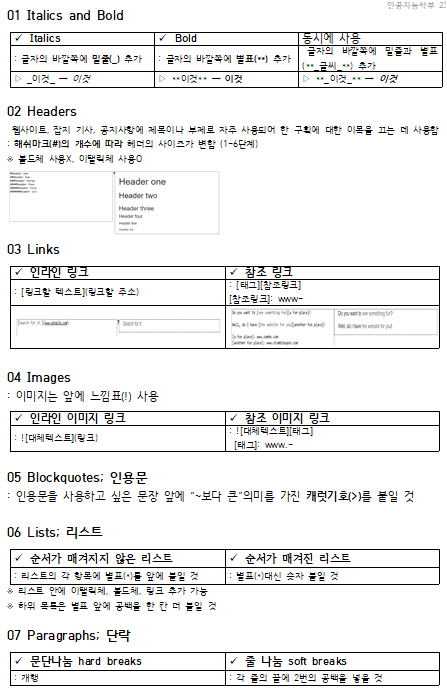

# 오픈소스SW개발론

## Introduction
Software whose copyright holder gives the right to publish, use, copy, modify, and distribute the source code to everyone.

-------------
## Week1-1 강의 개요 (강의계획서)

* Theme #01 **OSS**  
* Theme #02 **Git**  
* Theme #03 **Haskell**

-------------
## Week1-2 오픈소스소프트웨어 개요

Q. WHAT IS **OPEN SOURCE SOFTWARE**?  
>Software whose copyright holder gives the right to publish, use, copy, modify, and distribute the source code to everyone.

1. **상용화 관점**
    * Commercial SW
    * Open Source SW
    > **공통점** : Protected by Intellectual Property Rights(지적재산권)
2. **철학적 관점**
    * Free Software _by Richard Stallman_
    * Open Source Software _by Eric S.Raymond_

Q. WHAT IS **OSS LICENSE**?
> The scope of use, reproduction, modification, and distribution rights of the open source software  
>(ex. GPL, LGPL, MIT, BSD, Apache, MPL)

-------------
## Week2-1 버전 관리 개요
### VCS (Version Control System)
> Track your files over time so that you can **easily get back to a previous** working version
* Centralized VCS
    * CVS
    * SVN
    * Darcs
* Decentralized VCS
    * **GIT**
    * Mercurial
-------------
## Week2-2 Git
### GIT
> A distributed version control system _by Linus Torvalds_

[](git-scm.com)

-------------
## Week2-3 Github, fork, pull request


-------------
## Week2-4 Git: Advanced topics
> git 실습하기
>> Collaboration

```python
git init                              //git 사용선언
git add 파일이름                      //업로드할 파일 설정
git commit-m "커밋메세지"             //커밋&커밋메세지 입력
git remote add origin 원격저장소링크  //github 원격저장소와 연결
git push origin 브랜치이름            //업로드
```
-------------
### Week3 Markdown

